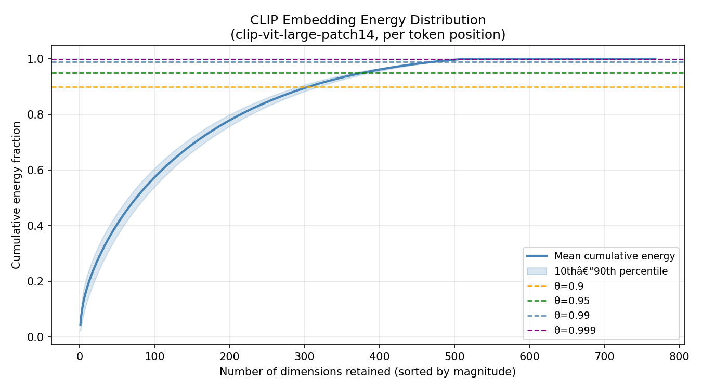
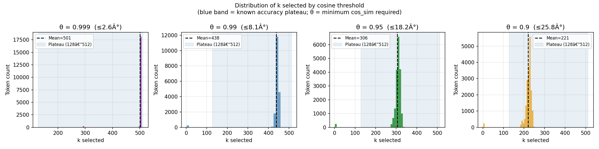

# STARK: Scalable Top-k Adaptive Reduction Kernel

**CS437 Deep Learning, Spring 2026**
Ali Azhar (27100083) | Muhammad Khizar (28100118)

---


[](https://www.kaggle.com/code/khizaryy/part-a-domainnet)
[](https://www.kaggle.com/code/khizaryy/partb-domainnet)
[](https://www.kaggle.com/code/khizaryy/v4baseline-a)
[](https://www.kaggle.com/code/khizaryy/v4baseline-b)
[](https://www.kaggle.com/code/khizaryy/final-master)

## Table of Contents

- [Project Overview](#project-overview)
- [Repository Structure](#repository-structure)
    - [`Part-a.ipynb`](#part-aipynb)
    - [`Part-b.ipynb`](#part-bipynb)
    - [`Master.ipynb`](#masteripynb)
- [Getting Started](#getting-started)
    - [Environment](#environment)
    - [Running the pipeline](#running-the-pipeline)
    - [Dependencies](#dependencies)
- [Key Innovations](#key-innovations)
    - [1. Cosine-threshold compression (SCOUT)](#1-cosine-threshold-compression-scout)
    - [2. Per-token adaptivity](#2-per-token-adaptivity)
    - [3. The accuracy plateau](#3-the-accuracy-plateau)
    - [4. Federated communication reduction at scale](#4-federated-communication-reduction-at-scale)
- [Experimental Results](#experimental-results)
    - [Dataset](#dataset)
    - [Energy curve](#energy-curve)
    - [SCOUT k distributions](#scout-k-distributions)
    - [Compression vs. cosine fidelity](#compression-vs-cosine-fidelity)
    - [Main result](#main-result)
    - [Generated artefacts](#generated-artefacts)
- [Citations](#citations)
  
## Project Overview

Federated learning (FL) trains a shared model across distributed clients without centralising raw data. The canonical protocol, FedAvg, requires many rounds of gradient exchange between clients and a central server, making communication cost the primary bottleneck at scale, particularly when client data is non-IID, which forces additional rounds to correct local model drift.

One-shot federated learning (OSFL) collapses communication to a single round. Recent OSFL methods exploit pre-trained diffusion models to have the server synthesise a shared training set from lightweight client uploads, rather than averaging model weights. OSCAR (Zaland et al., 2026) represents the current state of the art in this line: it eliminates client-side classifier training entirely by having clients run frozen BLIP captioning on their local images, encode the resulting captions through a frozen CLIP text encoder, and upload the 768-dimensional CLIP hidden states to condition Stable Diffusion on the server. Per-client upload drops to approximately 0.03M parameters, 768 floats per category, compared to 11.69M for FedCADO and 4.23M for FedDISC.

However, OSCAR's upload cost still scales linearly with client count and label cardinality. A deployment with 500 clients and 200 fine-grained categories requires each client to transmit 153,600 floats, and the server to process 500 × 200 such vectors before generation begins. No prior work has asked whether these conditioning vectors can themselves be compressed.

**STARK** addresses this gap. Its core contribution is **SCOUT** (Scalable Cosine-threshold OUtput Trimmer), an adaptive top-k selector that compresses each CLIP token vector, retaining only the minimum number of dimensions needed to preserve the embedding's *direction* to within a user-specified angular tolerance θ, before transmission. This is the last remaining communication bottleneck in the OSCAR framework at deployment scale, and it requires no changes to the generation or training pipeline: only a structured masking of the conditioning vector prior to upload.

### Why direction, not magnitude

Stable Diffusion conditions image generation on CLIP hidden states via cross-attention in the U-Net. Cross-attention is scale-invariant with respect to the conditioning vector: a scaled copy of the same embedding produces identical attention weights and therefore identical generation outputs. What matters is the *direction* of the CLIP embedding in R^768, not its L2 norm. Angular distortion, measured by cosine similarity, is therefore the correct compression objective. Energy thresholding (retaining dimensions that account for τ fraction of total L2 energy) is an indirect proxy for this and systematically over-compresses in the regime where direction is preserved but magnitude is not.

---

## Repository Structure

```
.
├── Part-a.ipynb          # OSCAR baseline pipeline: BLIP captioning, CLIP encoding, SD synthesis
├── Part-b.ipynb          # Downstream ResNet training and fixed-k accuracy evaluation
├── Master.ipynb          # SCOUT compression analysis and all paper figures
├── README.md
├── assets/
│   ├── energy_curve.png
│   ├── k_distribution_cosine.png
│   └── scout_main_result.png
└── Deliverables/
    ├── Deliverable_1.pdf
    ├── Deliverable_2.ipynb
    ├── Deliverable_3.ipynb
    └── Deliverable_4.ipynb
```

### `Part-a.ipynb`

Runs the full OSCAR-style preprocessing pipeline. BLIP captions each class's images in zero-shot; the captions are encoded through `clip-vit-large-patch14`, producing hidden states of shape `[N_captions, 77, 768]`, 77 token positions, each a 768-dimensional vector. These are saved per-class as `.npy` files to a persistent output directory. Stable Diffusion then synthesises a class-conditional training dataset from the uncompressed embeddings, which Part-b uses for downstream evaluation.

This notebook is pinned to a stable `diffusers` environment for reproducibility. The SD synthesis step is sensitive to library version and tokeniser behaviour; re-running on a different environment can produce subtly different embeddings that invalidate cross-run comparisons.

Expected runtime: **~5–6 hours** on Kaggle T4 × 2.

### `Part-b.ipynb`

Trains a ResNet-18 classifier on the synthetic NICO++ dataset from Part-a and evaluates it at multiple fixed top-k compression levels: k ∈ {32, 64, 128, 256, 512, 768}. The accuracy numbers it produces are the empirical ground truth that Master.ipynb's SCOUT analysis is validated against. This notebook is designed for the latest Kaggle training environment and does not require the heavy SD pipeline.

Expected runtime: **under 1 hour** on the same hardware.

### `Master.ipynb`

The primary research artifact. Loads saved CLIP embeddings from Part-a, confirms that CLIP energy distribution is non-uniform (which justifies compression), runs SCOUT at multiple θ values, verifies that achieved cosine similarity meets the target threshold, overlays dynamic-k distributions on the fixed-k accuracy curve, and saves all figures and summary tables. No synthesis or training is re-run here.

Expected runtime: **~7 minutes** on CPU-only Kaggle.

---

## Getting Started

### Environment

All notebooks are designed to run on **Kaggle** with the following setup:

- Part-a requires a T4 × 2 accelerator and internet enabled for model downloads on first run.
- Part-b requires a T4 (single) or CPU; the training step is lightweight.
- Master requires no GPU. It runs on the Kaggle CPU-only baseline.

The heavy generation step (Part-a) is the computationally dominant phase. The CLIP encoding step within it is inexpensive and can be reproduced independently of the SD synthesis.

### Running the pipeline

**Step 1, Part-a** (embedding generation and SD synthesis)

Open `Part-a.ipynb` on Kaggle. Ensure the OSCAR dataset source is attached. Run all cells. On completion, note the output path for the `embeddings/nico_unique/` directory, this is `EMB_DIR` in subsequent notebooks.

**Step 2, Part-b** (downstream evaluation)

Open `Part-b.ipynb`. Attach the Part-a notebook as a data source so the synthetic training data is accessible. Run all cells. Record the fixed-k accuracy values printed at the end, these populate `FIXED_K_RESULTS` in Master.ipynb.

**Step 3, Master** (SCOUT analysis)

Open `Master.ipynb`. In the config block (Section 0), set:

```python

# Since cosine-similarity requires a reference;
# Pre-extracted NICO++ CLIP embeddings are available at: 
# https://www.kaggle.com/datasets/khizaryy/baseline-run-outputs/versions/1
# (ensure fetching Version 1 of the dataset and not later versions)

# Or if runnign pipeline from scratch, after running baseline on nico_unique
EMB_DIR = Path("/kaggle/input/<your-part-a-output>/embeddings/nico_unique")

```

Run all cells. All figures and summary artefacts are saved to `/kaggle/working/scout_analysis/`.

### Dependencies

All dependencies are available in the standard Kaggle Python environment. No additional `pip install` calls are required for Master.ipynb or Part-b. Part-a requires `diffusers`, `transformers`, `torch`, and `open_clip`, all present in the pinned Kaggle SD environment.

---

## Key Innovations

### 1. Cosine-threshold compression (SCOUT)

SCOUT replaces the conventional energy-threshold selection criterion with a cosine-similarity criterion that directly targets the quantity Stable Diffusion's cross-attention depends on. For each token vector **v** ∈ R^768, SCOUT finds:

```
k* = min { k : cos_sim(v, v_k) ≥ θ }
```

where v_k retains only the top-k dimensions of **v** by absolute magnitude and zeros the rest. This is computed greedily in a single forward pass per token: dimensions are added in descending order of |v_i|, and the loop terminates as soon as the cosine threshold is met. The result is the *minimum* k that achieves the required directional fidelity for that specific token vector, rather than a fixed k applied uniformly.

Zero-norm token positions (padding slots in the 77-token sequence) are returned at full dimensionality without compression, since cosine similarity is undefined for zero vectors.

### 2. Per-token adaptivity

Unlike fixed-k compression, SCOUT selects a different k for each token position within a caption's embedding, and a different k for each caption. Tokens whose energy is highly concentrated compress to a small k; tokens with more diffuse energy require a larger k to meet the same angular tolerance. The k distribution across tokens therefore has a well-defined mean and standard deviation rather than being a single point, directly visible in the `k_distribution_cosine.png` output.

### 3. The accuracy plateau

Part-b establishes empirically that test accuracy on NICO++ is flat between k=128 and k=512 (both yield ~71%), despite a 4× difference in embedding dimensionality. This plateau means there is a large compression window in which directional fidelity and downstream accuracy are simultaneously preserved. SCOUT's θ parameter is calibrated to land inside this window automatically, without per-dataset tuning of k.

### 4. Federated communication reduction at scale

At deployment scale with 500 clients and 200 categories, OSCAR transmits 500 × 200 × 768 = 76,800,000 floats per round. At SCOUT's θ=0.99 operating point (mean k≈438), this becomes approximately 500 × 200 × 438 = 43,800,000 floats, a 43% reduction in aggregate upload with cosine fidelity of 0.9901 and mean angular distortion below 8.1°. The reduction scales multiplicatively with client count and label cardinality, making it most valuable precisely where OSCAR's linear scaling is most painful.

---

## Experimental Results

### Dataset

The analysis uses NICO++ embeddings from 12 object classes: bear, cat, chair, dog, flower, hat, kangaroo, lizard, motorcycle, scooter, shrimp, and train. Each class contributes 20 BLIP-generated captions, yielding 240 total CLIP embeddings of shape `[77, 768]`, 18,480 individual token vectors used in the SCOUT sweep. A secondary DomainNet subset is also analysed to validate threshold transferability across domains.

### Energy curve

The cumulative energy curve, averaged over all 18,480 token vectors, is strongly concave: the top-ranked dimensions account for a disproportionately large fraction of total L2 energy. The 10th–90th percentile band across all token positions is narrow, confirming this concentration is consistent across token positions and caption types. This non-uniformity is the prerequisite for compression being worthwhile: if CLIP energy were uniformly distributed, no threshold-based selector would outperform a random selector.


> **Figure 1**, Cumulative normalised energy vs. dimensions retained, averaged over all NICO++ tokens, with the 10th–90th percentile band shaded. Horizontal dashed lines mark cosine thresholds θ ∈ {0.90, 0.95, 0.99, 0.999}. The strongly concave shape confirms non-uniformity and motivates adaptive compression. A secondary NICO++ vs. DomainNet overlay shows near-identical curve profiles, supporting cross-dataset threshold transfer.

### SCOUT k distributions


> **Figure 2**, Histograms of per-token k values selected by SCOUT at each θ. The spread around the mean illustrates that per-token adaptivity produces a distribution of k values rather than a fixed point, and that more aggressive thresholds (lower θ) shift the distribution left and broaden it.

### Compression vs. cosine fidelity

Results from the SCOUT sweep on the `bear` class embedding (20 captions, 1,540 token vectors), used as the representative sample.

**Fixed-k baselines:**

| k (dims retained) | Mean cosine similarity | Compression |
|---|---|---|
| 512 | 1.0000 | 33.3% |
| 256 | 0.9213 | 66.7% |
| 128 | 0.7977 | 83.3% |
| 64 | 0.6678 | 91.7% |
| 32 | 0.5498 | 95.8% |

**SCOUT dynamic-k (θ sweep):**

| θ | Max angular deviation | Mean k selected | Compression | Achieved cosine similarity |
|---|---|---|---|---|
| 0.999 | ≤ 2.6° | 500.9 | 34.8% | 0.9991 |
| 0.990 | ≤ 8.1° | 437.8 | 43.0% | 0.9901 |
| 0.950 | ≤ 18.2° | 305.8 | 60.2% | 0.9507 |
| 0.900 | ≤ 25.8° | 220.6 | 71.3% | 0.9015 |

**Fixed-k downstream accuracy (Part-b, NICO++ test set):**

| k | Test accuracy (%) | In plateau? |
|---|---|---|
| 768 (uncompressed) | 73.0 |, |
| 512 | 71.0 | ✅ |
| 128 | 71.0 | ✅ |
| 64 | 66.3 | ❌ |
| 32 | 52.1 | ❌ |

### Main result

> **Figure 3** (`assets/scout_main_result.png`), Fixed-k accuracy curve (blue line) overlaid with vertical dashed lines showing where each SCOUT θ places its mean k. The shaded horizontal band marks the 70–73% accuracy plateau at k ∈ [128, 512]. Each vertical line includes a ±1 std band showing per-token k variation. This is the core paper figure: it shows that θ=0.99 lands inside the plateau with 43% compression and sub-8.1° angular distortion per token.

At θ=0.99, SCOUT selects a mean k of 437.8, which falls inside the empirical accuracy plateau [128, 512], achieves a cosine similarity of 0.9901, and compresses the per-category embedding by 43% relative to the uncompressed baseline. A single threshold value, with no per-dataset tuning of k, automatically reproduces the directional fidelity needed to stay in the high-accuracy region of the k-accuracy curve.

### Generated artefacts

Master.ipynb saves the following to `/kaggle/working/scout_analysis/` also available in this repo at `/assets/`:

| File | Contents |
|---|---|
| `energy_curve.png` | Cumulative energy curve with percentile band and cosine threshold reference lines |
| `k_distribution_cosine.png` | Per-token k histograms across all θ values |
| `scout_main_result.png` | Fixed-k accuracy curve with SCOUT overlay, the primary paper figure |
| `scout_summary.csv` | Per-θ table: mean k, median k, std, min, max, compression %, plateau status |
| `scout_final_summary.json` | Machine-readable report with plateau range, per-θ summary, and recommended θ |

---

## Citations

[1] B. McMahan, E. Moore, D. Ramage, S. Hampson, and B. A. y Arcas. Communication-efficient learning of deep networks from decentralized data. *AISTATS (PMLR)*, 2017. Introduces FedAvg and establishes communication cost as the primary FL bottleneck. All OSFL approaches, including OSCAR and this project, are motivated by reducing the round count that FedAvg requires.

[2] P. Kairouz, H. B. McMahan, B. Avent, et al. Advances and open problems in federated learning. *Foundations and Trends in Machine Learning*, 14(1–2):1–210, 2021. Definitive survey of FL communication reduction strategies; identifies non-IID data distribution as the root cause of slow convergence and flags deployment-scale upload cost as an open problem.

[3] N. Guha, A. Talwalkar, and V. Smith. One-shot federated learning. *arXiv:1902.11175*, 2019. Proposes the OSFL setting and establishes feasibility via ensemble distillation. The foundational paper for the problem setting this project operates within.

[4] J. Zhang, C. Chen, B. Li, et al. DENSE: Data-free one-shot federated learning. *NeurIPS*, vol. 35, 2022. First DM-free data generation approach to OSFL using client-uploaded classifiers. The large upload size of DENSE motivates compressed encoding alternatives.

[5] Y. Zhou, G. Pu, X. Ma, X. Li, and D. Wu. Distilled one-shot federated learning. *arXiv:2009.07999*, 2020. Clients share distilled synthetic data instead of model weights. An early framing of the synthetic-data paradigm for OSFL that DM-based methods extend.

[6] M. Yang, S. Su, B. Li, and X. Xue. One-shot federated learning with classifier-guided diffusion models. *arXiv:2311.08870*, 2023. FedCADO: first integration of classifier-guided diffusion into OSFL. Primary SOTA baseline at 11.69M parameters uploaded per client.

[7] M. Yang, S. Su, B. Li, and X. Xue. Exploring one-shot semi-supervised federated learning with pre-trained diffusion models. *AAAI*, vol. 38, 2024. FedDISC reduces FedCADO's upload to 4.23M parameters by sharing feature statistics. Secondary SOTA baseline and intermediate point on the communication–accuracy tradeoff curve.

[8] O. Zaland, S. Jin, F. T. Pokorny, and M. Bhuyan. One-shot federated learning with classifier-free diffusion models. *arXiv:2502.08488*, 2026. OSCAR: replaces classifier training with frozen BLIP captioning and CLIP encoding, reducing per-client upload to 0.03M parameters (768 floats per category). Direct foundation for this project; STARK proposes top-k compression of OSCAR's CLIP encodings to further reduce upload at deployment scale.

[9] J. Ho and T. Salimans. Classifier-free diffusion guidance. *arXiv:2207.12598*, 2022. Proposes jointly training conditional and unconditional diffusion models and combining their score estimates at inference. The theoretical underpinning of the generation mechanism OSCAR and this project inherit; understanding the score-mixing formulation is essential for reasoning about how sparse conditioning vectors affect generation quality.

[10] R. Rombach, A. Blattmann, D. Lorenz, P. Esser, and B. Ommer. High-resolution image synthesis with latent diffusion models. *CVPR*, 2022. Introduces Stable Diffusion. Cross-attention conditioning in the U-Net is where the CLIP encoding exerts its influence on generation, making this reference essential for understanding which dimensions of the embedding are load-bearing.

[11] A. Radford, J. W. Kim, C. Hallacy, et al. Learning transferable visual models from natural language supervision. *ICML (PMLR)*, 2021. Introduces CLIP. The 768-dimensional text encoder space that STARK's compression operates in; the geometry and sparsity properties of this space directly determine the feasibility of top-k compression.

[12] J. Li, D. Li, C. Xiong, and S. Hoi. BLIP: Bootstrapping language-image pre-training for unified vision-language understanding and generation. *ICML (PMLR)*, 2022. Introduces BLIP, the zero-shot captioning model that OSCAR clients use upstream of CLIP encoding. Caption quality affects the resulting embedding and therefore the sensitivity of compressed embeddings to directional distortion.
